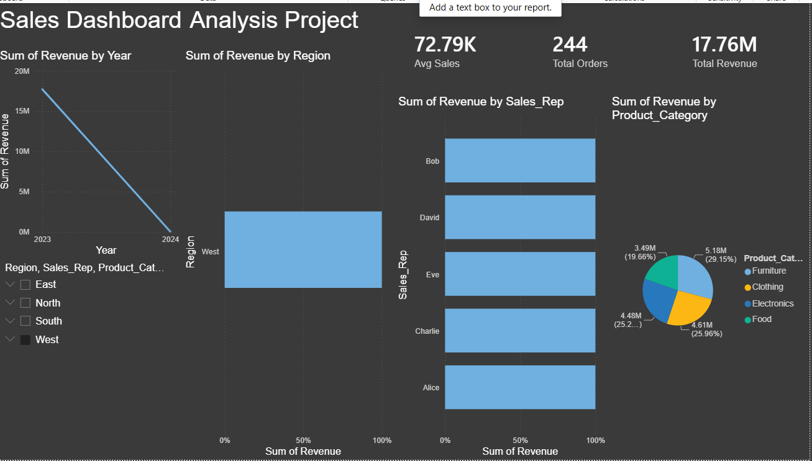

# Sales Data Analysis Dashboard

## Project Overview

Analyzed 10,000+ sales records to identify revenue trends and business insights using Python, SQL, and Power BI.

## Tools Used

* Python
* Pandas
* SQL
* Power BI
* Git & GitHub

## Dashboard Preview

## Project Workflow

1. Data Cleaning using Python
2. Data Analysis using Pandas
3. SQL Queries for business insights
4. Power BI Dashboard creation
5. KPI reporting and visualization

## Files

* data/sales_data.csv
* scripts/cleaning.py
* notebooks/analysis.ipynb
* sql/queries.sql
* output/cleaned_data.csv
* output/final_data_for_powerbi.csv

## Key Insights

* Region-wise sales performance
* Sales representative performance
* Product category analysis
* Revenue trend analysis

## Dashboard

Power BI dashboard includes:

* Total Revenue KPI
* Total Orders KPI
* Average Sales KPI
* Region-wise Sales Chart
* Sales Rep Performance Chart
* Product Category Distribution
# sales-data-analysis-dashboard-project

Final GitHub Structure
Sales-Project/
│
├── data/
│   └── sales_data.csv
├── scripts/
│   └── cleaning.py
├── notebooks/
│   └── analysis.ipynb
├── output/
│   └── final_data_for_powerbi.csv
├── sql/
│   └── queries.sql
├── SalesDashboard.pbix
└── README.md
